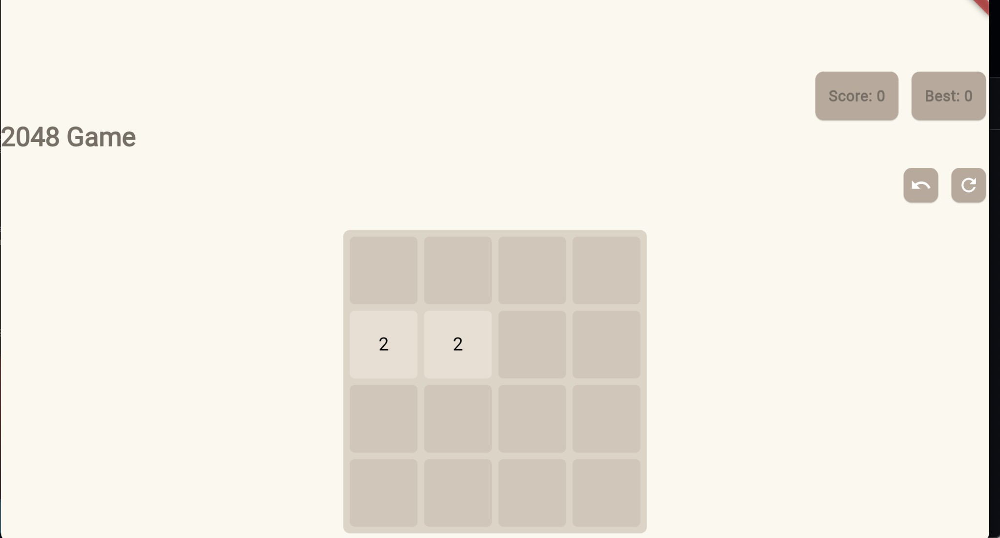

# 2048 Game

A Flutter implementation of the classic **2048** puzzle game. Slide tiles, merge matching numbers, and try to reach the 2048 tile.



---

## What is 2048?

2048 is a single-player sliding-tile puzzle played on a 4×4 grid. Tiles with the same number merge into one when they collide, doubling their value. The goal is to create a tile with the number **2048** (and optionally keep playing for higher numbers). The game ends when the grid is full and no move can merge any tiles.

---

## How to Play

### Goal
- **Win:** Create a tile with the number **2048**.
- You can keep playing after winning to aim for 4096, 8192, and beyond.
- **Lose:** The board fills up and there are no possible moves (no adjacent equal tiles to merge).

### Controls
- **Desktop / Keyboard:** Use the **arrow keys** (↑ ↓ ← →) to move tiles in that direction.
- **Mobile / Touch:** **Swipe** on the game board in the direction you want to move (up, down, left, or right).

### Rules
1. Every move slides all tiles as far as possible in the chosen direction.
2. When two tiles with the **same number** touch, they **merge** into one tile with their sum (e.g. 2 + 2 → 4, 4 + 4 → 8).
3. After each move that changes the board, one new tile (value 2) appears in a random empty cell.
4. **Score** increases by the value of each new tile created by a merge (e.g. merging two 4s adds 8 to your score).
5. **Best** shows your highest score in this app session (it is kept when you start a new game).

### In-game actions
- **Undo:** Reverts the last move (board and score). You can undo multiple times.
- **New game (↻):** Restarts the game with a fresh board and score; your Best score is kept.

---

## Getting Started (Flutter)

```bash
flutter pub get
flutter run
```

This project is a Flutter application. For more on Flutter, see the [official documentation](https://docs.flutter.dev/).
